# ErasmusFrontend

## Authentication
During an authentication process one can:
- login
- register as new user and person respectively

Login page:
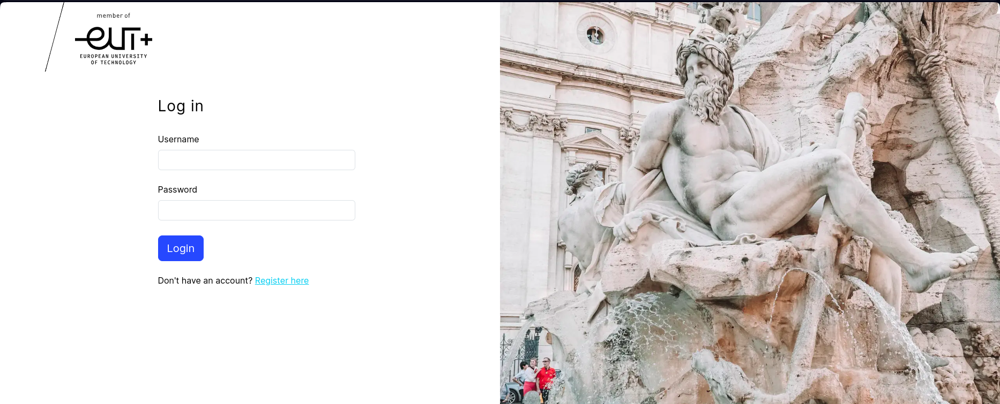

New User Registration:
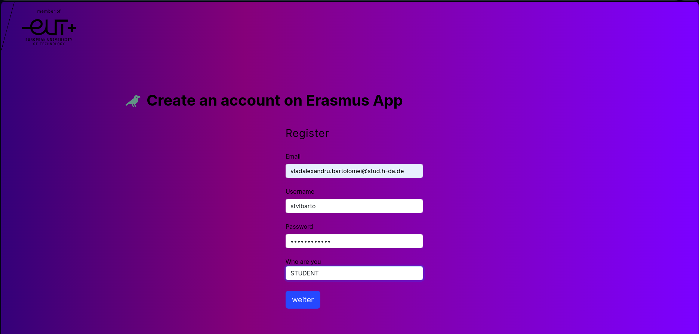

New Representative Registration:
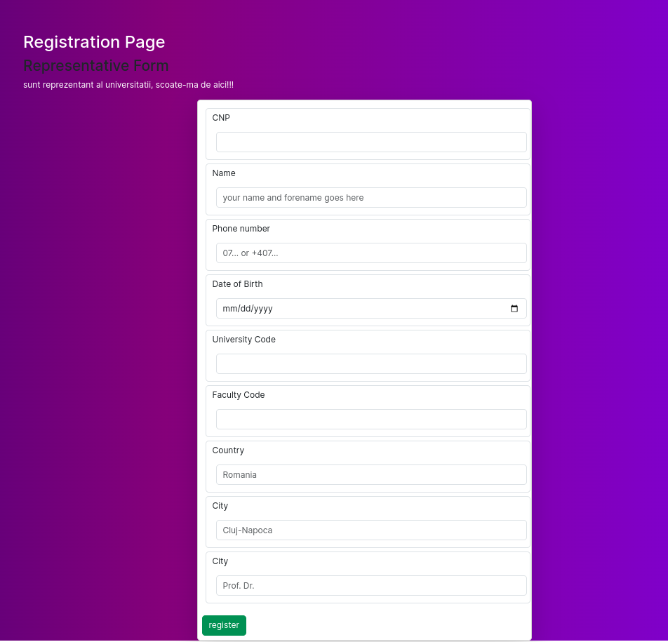

New Student Registration:
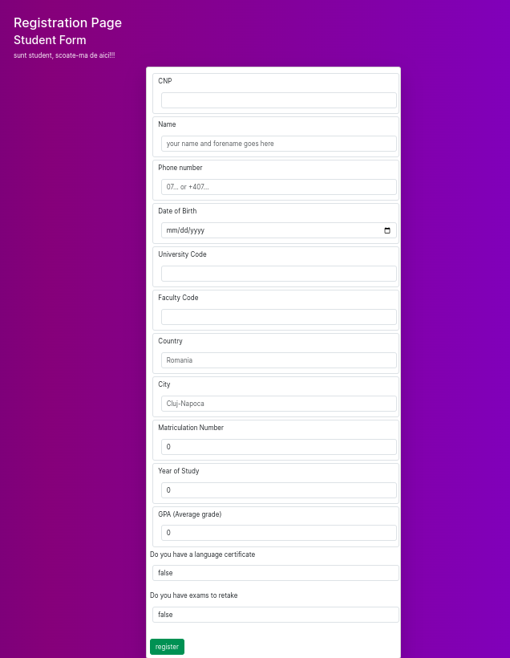

Confirmation page:
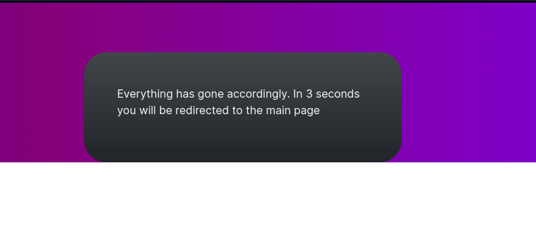

## Not Found
In case of anything, there is a not found page.
The link with *Întoarce-te la start* actually works!
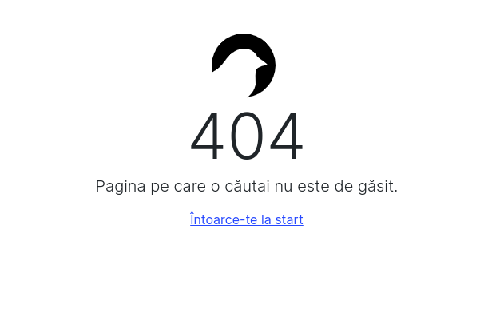

## Dashboard
Everything starts on a home page:
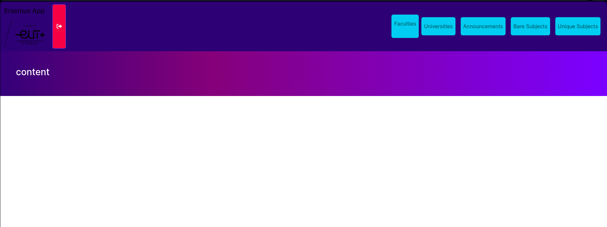

with buttons that will redirect you to each corresponding "Entity" page.

### Faculty
Faculties:
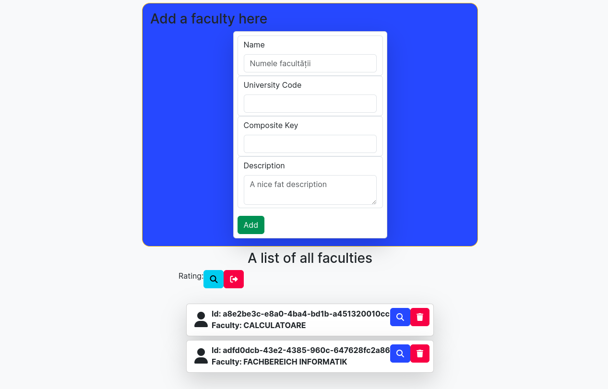

One Faculty's Details:
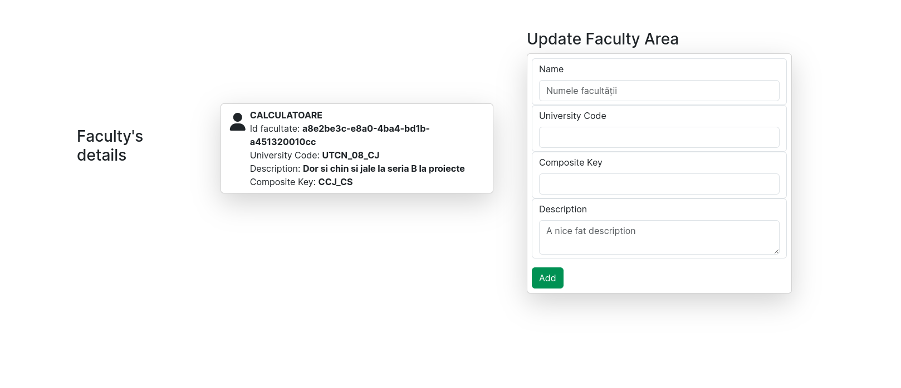

### Announcements
(My pride when it comes to design)
Announcements:
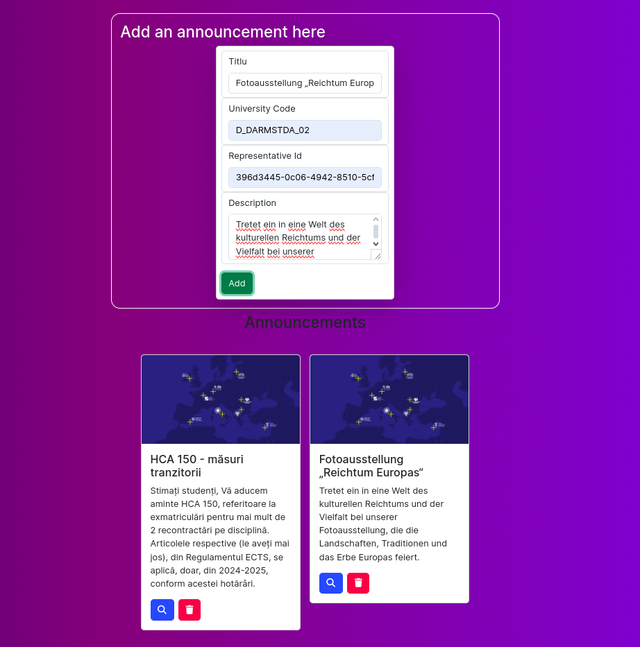

One Announcement:
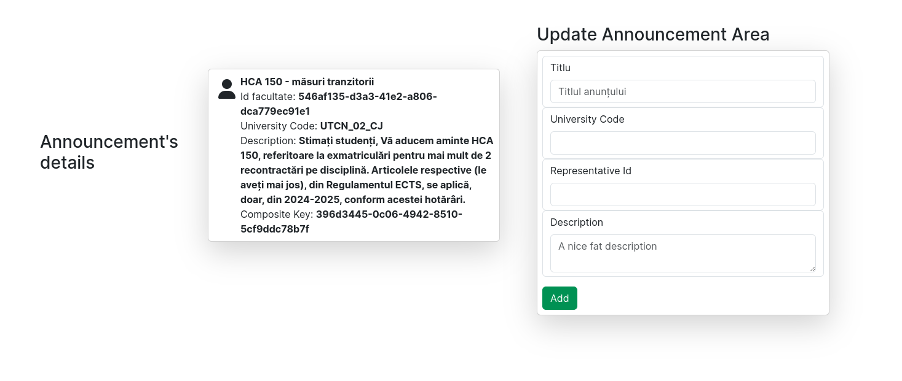

### Bare Subject
Bare subjects:

One Bare Subject:
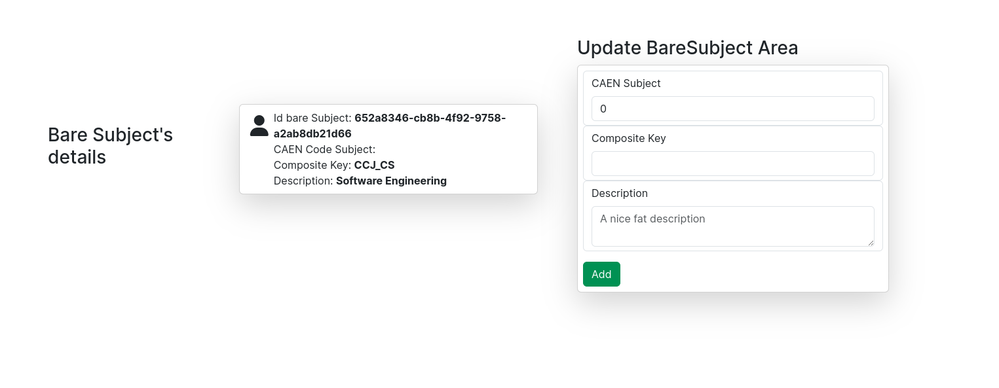

### Unique Subject
Unique subjects:
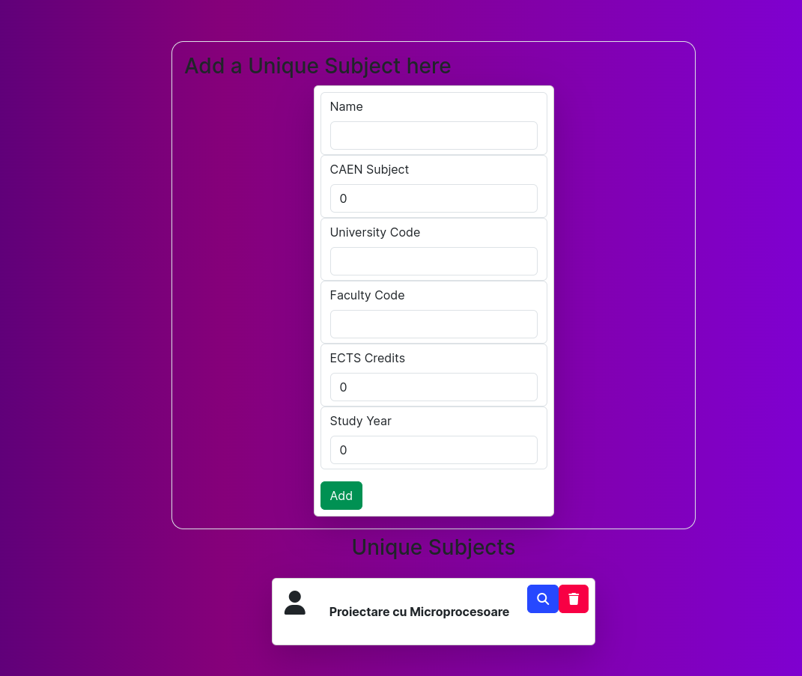

UniqueSubject:
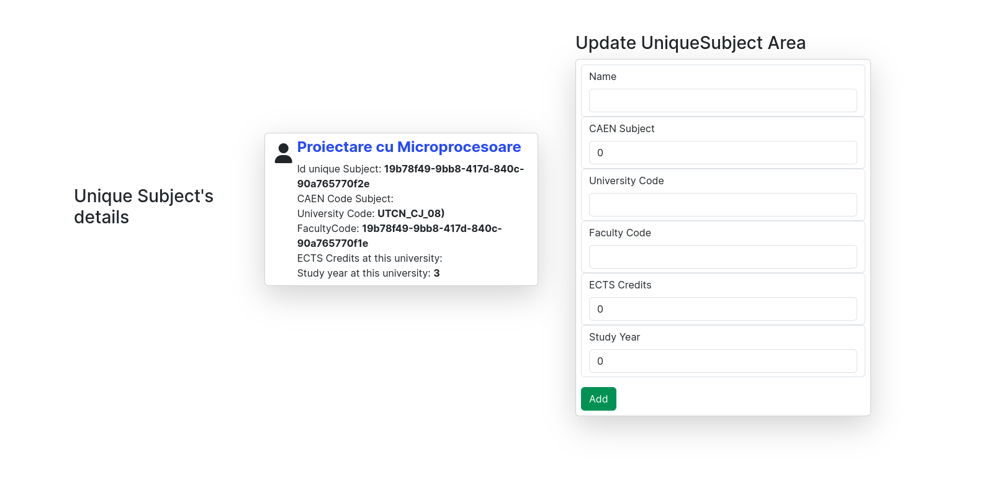

