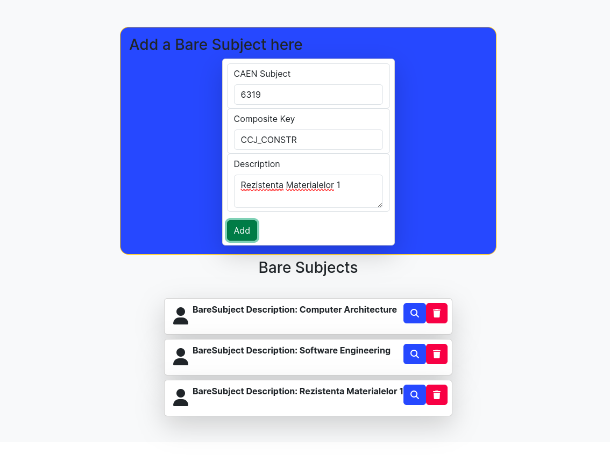

# ErasmusFrontend

## Teste frontend
- am incercat sa fac una bucata test in `home.component.spec.ts`
- nu am reusit sa rulez teste in frontend, prin urmare nu le-am mai implementat
  
## Authentication
During an authentication process one can:
- login
- register as new user and person respectively

Login page:

New User Registration:

New Representative Registration:

New Student Registration:

Confirmation page:

## Not Found
In case of anything, there is a not found page.
The link with *Întoarce-te la start* actually works!

## Dashboard
Everything starts on a home page:

with buttons that will redirect you to each corresponding "Entity" page.

### Faculty
Faculties:

One Faculty's Details:

### Announcements
(My pride when it comes to design)
Announcements:

One Announcement:

### Bare Subject
Bare subjects:

One Bare Subject:

### Unique Subject
Unique subjects:

UniqueSubject:

